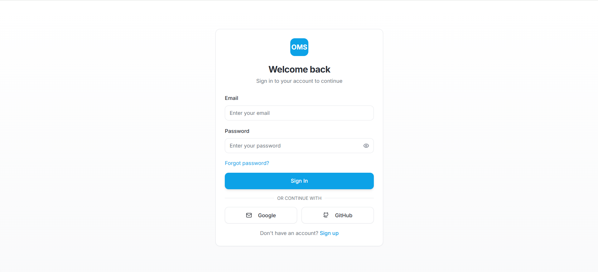
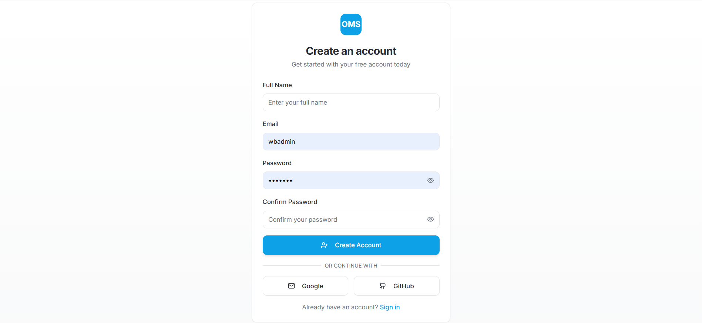
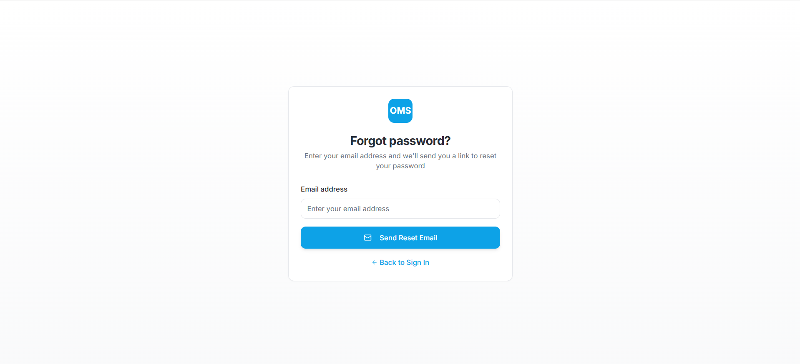
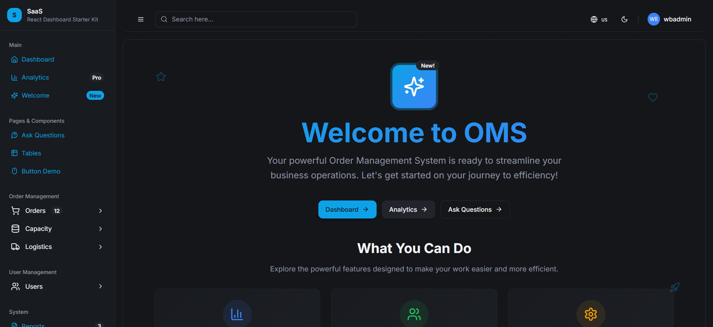
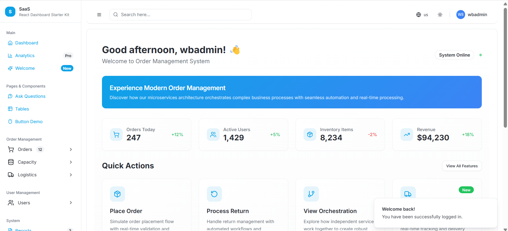
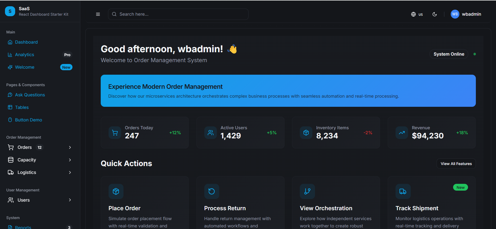
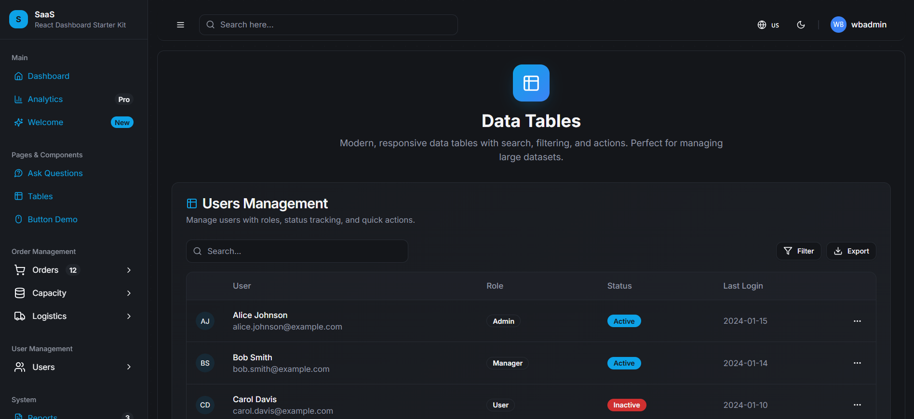

# ⚡ React Dashboard Starter Kit

A modern, customizable React + Vite starter kit with Tailwind CSS, ShadCN UI, and a clean layout featuring a collapsible sidebar, topbar, toast notifications, and multiple utility pages. Ideal for dashboards, admin panels, and creative projects.

---

## ✨ Features

- ⚛️ Built with **React 18 + Vite**
- 💅 **Tailwind CSS** for utility-first styling
- 🎨 **ShadCN UI** components for polished UI
- 🌓 Light and Dark mode support
- 🧭 Fully responsive layout
- 🧱 **Collapsible Sidebar** with icon shrink handling
- 🔍 Topbar with search functionality
- 🧁 Custom `Toast` system with rich styling
- 🖼️ Creative **Welcome Page**
- 📄 Pages with forms, cards, buttons, and tables
- 🔧 Easily extensible structure
- 🎉 Smooth transitions and modern UI patterns

---

## 🚀 Getting Started

### 1. Clone the Repo

```bash
git clone https://github.com/abhishekra07/react-dashboard-starter-kit.git
cd react-dashboard-starter-kit
```

### 2. Install Dependencies

```bash
npm install
```

### 3. Start the Dev Server

```bash
npm run dev
```

Visit `http://localhost:8080` to view the app.

---

## 🧭 Project Structure

```
src/
│
├── components/         # UI components (sidebar, header, toast, etc.)
├── pages/              # App pages (Home, Welcome, Forms, Buttons, etc.)
├── routes/             # App route definitions
├── theme/              # Tailwind + shadcn theme config
├── hooks/              # Custom hooks
├── lib/                # Utility functions (e.g., toast)
├── App.tsx             # Root layout
└── main.tsx            # App entry point
```

---

## 📦 Included Pages

- `Dashboard` – Transaction summary with charts
- `Welcome` – Creative entry page with doodles and welcome message
- `Ask a Question` – Text area and link cards + GitHub form section
- `Tables Demo` – Data table example
- `Buttons Showcase` – All button styles with variations

---

## 🌈 Styling

Tailwind is fully configured with a custom theme and dark mode support. You can adjust styling in `tailwind.config.ts`.

---

## 🛠️ Customization

- Update sidebar links from `src/components/sidebar.tsx`
- Add new pages under `src/pages` and include them in the sidebar
- Modify layout spacing and rounded corners in `App.tsx`

---

## 🌐 Deployment

To build for production:

```bash
npm run build
```

To preview production build locally:

```bash
npm run preview
```

---

## 📸 Screenshots















👨‍💻 **Developed by:** _Abhishek Rathore_
